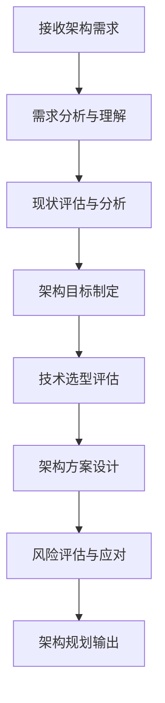
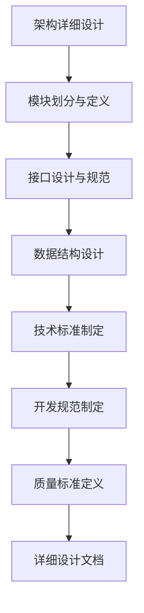
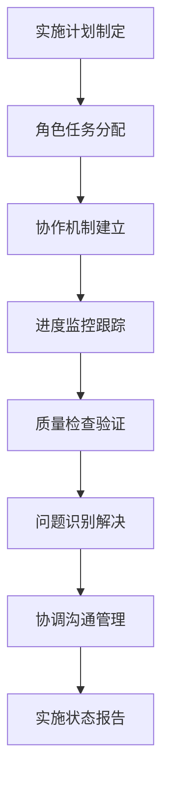
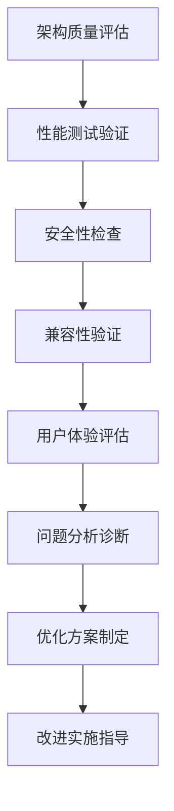
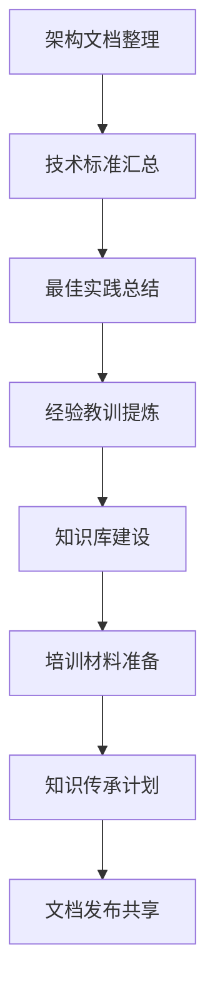

# 架构设计工作流程

## 技术约束

### 1. 架构复杂度管理
- **模块数量限制**：单个系统的核心模块数量不超过12个
- **依赖层次控制**：模块依赖层次不超过5层
- **接口数量约束**：单个模块对外接口不超过8个
- **耦合度控制**：模块间耦合度评分不低于80分

### 2. 技术标准一致性
- **编码规范统一**：所有代码必须遵循统一的编码规范
- **文档格式标准**：技术文档必须符合既定的格式标准
- **接口规范一致**：所有接口必须遵循统一的设计规范
- **版本管理规范**：严格执行版本控制和发布流程

### 3. 性能指标要求
- **响应时间控制**：系统响应时间不超过2秒
- **并发处理能力**：支持至少100个并发用户
- **可用性保证**：系统可用性不低于99.5%
- **扩展性指标**：支持10倍业务量增长的扩展能力

### 4. 质量保证标准
- **代码覆盖率**：单元测试覆盖率不低于85%
- **文档完整性**：技术文档覆盖率达到100%
- **安全性检查**：通过全面的安全性评估
- **兼容性验证**：确保向后兼容性和跨平台兼容性

## 强制规则

### 1. 架构设计强制原则
- **模块化设计原则**：所有功能必须按照模块化原则进行设计
- **接口标准化原则**：所有模块间交互必须通过标准化接口
- **文档同步更新原则**：架构变更必须同步更新相关文档
- **版本控制原则**：所有架构变更必须纳入版本控制管理

### 2. 质量检查强制要求
- **设计评审强制执行**：所有架构设计必须经过正式评审
- **测试验证强制要求**：所有架构变更必须经过充分测试
- **安全评估强制执行**：涉及安全的架构变更必须经过安全评估
- **性能验证强制要求**：关键架构变更必须经过性能验证

### 3. 协作规范强制执行
- **角色职责明确原则**：各角色职责必须明确界定，不得越权
- **沟通流程规范原则**：重要决策必须遵循既定的沟通流程
- **变更通知强制要求**：架构变更必须及时通知相关角色
- **知识共享强制执行**：重要技术知识必须及时共享和文档化

### 4. 风险控制强制措施
- **风险评估强制执行**：重大架构决策必须进行风险评估
- **备选方案强制准备**：关键架构必须准备备选方案
- **监控机制强制建立**：重要系统必须建立监控和预警机制
- **应急预案强制制定**：关键系统必须制定应急响应预案

## 设计原则

### 1. 系统性设计原则
从整体出发，统筹考虑各个子系统的关系，确保架构的整体性和协调性。

### 2. 前瞻性设计原则
基于技术发展趋势和业务需求变化，制定具有前瞻性的架构规划。

### 3. 实用性设计原则
架构设计必须贴近实际需求，具有良好的可实施性和实用价值。

### 4. 可持续性设计原则
考虑架构的长期可维护性和可扩展性，确保系统的可持续发展。

## 标准化工作流程

### 阶段1：需求分析与架构规划 (45分钟)

**核心任务**：
- 深入理解业务需求和技术要求
- 评估现有系统架构和技术栈
- 制定明确的架构目标和成功标准
- 进行技术选型和方案比较
- 设计整体架构方案和实施路径
- 识别潜在风险并制定应对策略

**输出标准**：
- 需求分析报告（完整性≥95%）
- 架构设计方案（可行性≥90%）
- 技术选型报告（合理性≥85%）
- 风险评估报告（覆盖率≥90%）

### 阶段2：详细设计与标准制定 (60分钟)

**核心任务**：
- 进行详细的架构设计和模块划分
- 设计标准化的接口规范和数据格式
- 制定统一的技术标准和开发规范
- 定义质量标准和评估体系
- 设计监控和诊断机制
- 制定测试策略和验证方案

**输出标准**：
- 详细架构设计文档（完整性≥98%）
- 接口规范文档（标准化程度≥95%）
- 技术标准文档（覆盖率≥90%）
- 质量标准文档（可操作性≥90%）

### 阶段3：实施指导与协作协调 (持续进行)

**核心任务**：
- 制定详细的实施计划和时间表
- 协调各专业角色的任务分配和协作
- 建立有效的沟通和协作机制
- 监控实施进度和质量状况
- 及时识别和解决实施中的问题
- 提供技术指导和支持

**输出标准**：
- 实施计划文档（可执行性≥90%）
- 角色协作机制（效率提升≥20%）
- 进度监控报告（准确性≥95%）
- 问题解决方案（有效性≥85%）

### 阶段4：质量验证与优化改进 (40分钟)

**核心任务**：
- 全面评估架构的质量和性能
- 进行安全性和兼容性验证
- 评估用户体验和使用效果
- 分析存在的问题和改进空间
- 制定优化改进方案
- 指导优化措施的实施

**输出标准**：
- 质量评估报告（全面性≥95%）
- 性能测试报告（准确性≥90%）
- 安全评估报告（覆盖率≥100%）
- 优化改进方案（可行性≥85%）

### 阶段5：文档完善与知识传承 (35分钟)

**核心任务**：
- 整理和完善架构相关文档
- 汇总技术标准和规范文档
- 总结项目中的最佳实践
- 提炼经验教训和改进建议
- 建设技术知识库和资源库
- 制定知识传承和培训计划

**输出标准**：
- 完整架构文档库（完整性≥98%）
- 技术标准规范（实用性≥90%）
- 最佳实践指南（可操作性≥85%）
- 知识传承计划（有效性≥80%）

## 量化质量标准

### 1. 架构设计质量 (权重25%)
- **设计完整性**：架构设计覆盖所有功能需求 (≥95%)
- **设计合理性**：架构方案的技术合理性评分 (≥85%)
- **可扩展性**：支持未来业务扩展的能力评估 (≥80%)
- **可维护性**：架构的可维护性和可理解性 (≥85%)

### 2. 技术标准质量 (权重20%)
- **标准完整性**：技术标准覆盖所有关键领域 (≥90%)
- **标准一致性**：各项标准之间的一致性程度 (≥95%)
- **标准实用性**：标准的可操作性和实用价值 (≥85%)
- **标准更新性**：标准的及时更新和维护 (≥80%)

### 3. 协作协调质量 (权重25%)
- **角色协调效率**：跨角色协作的效率提升 (≥20%)
- **沟通机制有效性**：沟通机制的有效性评估 (≥85%)
- **问题解决及时性**：问题识别和解决的及时性 (≥90%)
- **团队满意度**：团队对协作效果的满意度 (≥80%)

### 4. 质量保证效果 (权重20%)
- **质量标准执行率**：质量标准的执行情况 (≥95%)
- **缺陷发现率**：架构缺陷的发现和修复率 (≥90%)
- **性能达标率**：性能指标的达标情况 (≥85%)
- **安全合规率**：安全要求的合规程度 (≥100%)

### 5. 综合效果评估 (权重10%)
- **项目成功率**：基于架构的项目成功率 (≥90%)
- **用户满意度**：最终用户的满意度评价 (≥85%)
- **技术债务控制**：技术债务的控制和管理 (≥80%)
- **持续改进效果**：持续改进的效果评估 (≥75%)

**综合评分计算**：
总分 = 架构设计质量×25% + 技术标准质量×20% + 协作协调质量×25% + 质量保证效果×20% + 综合效果评估×10%

**质量等级标准**：
- 优秀：综合评分 ≥ 90分
- 良好：综合评分 ≥ 80分
- 合格：综合评分 ≥ 70分
- 需改进：综合评分 < 70分