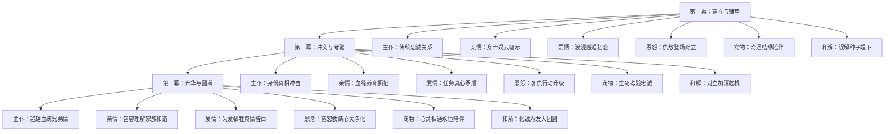
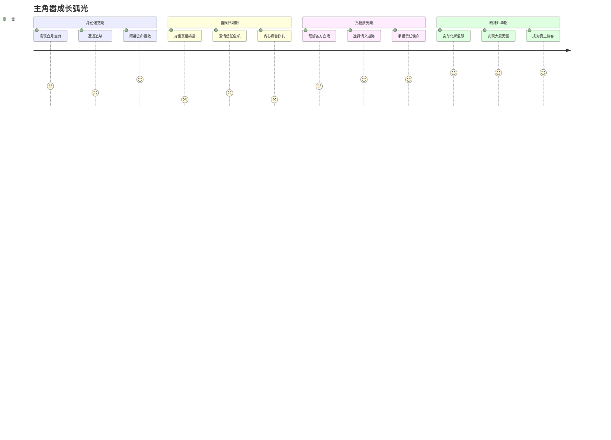
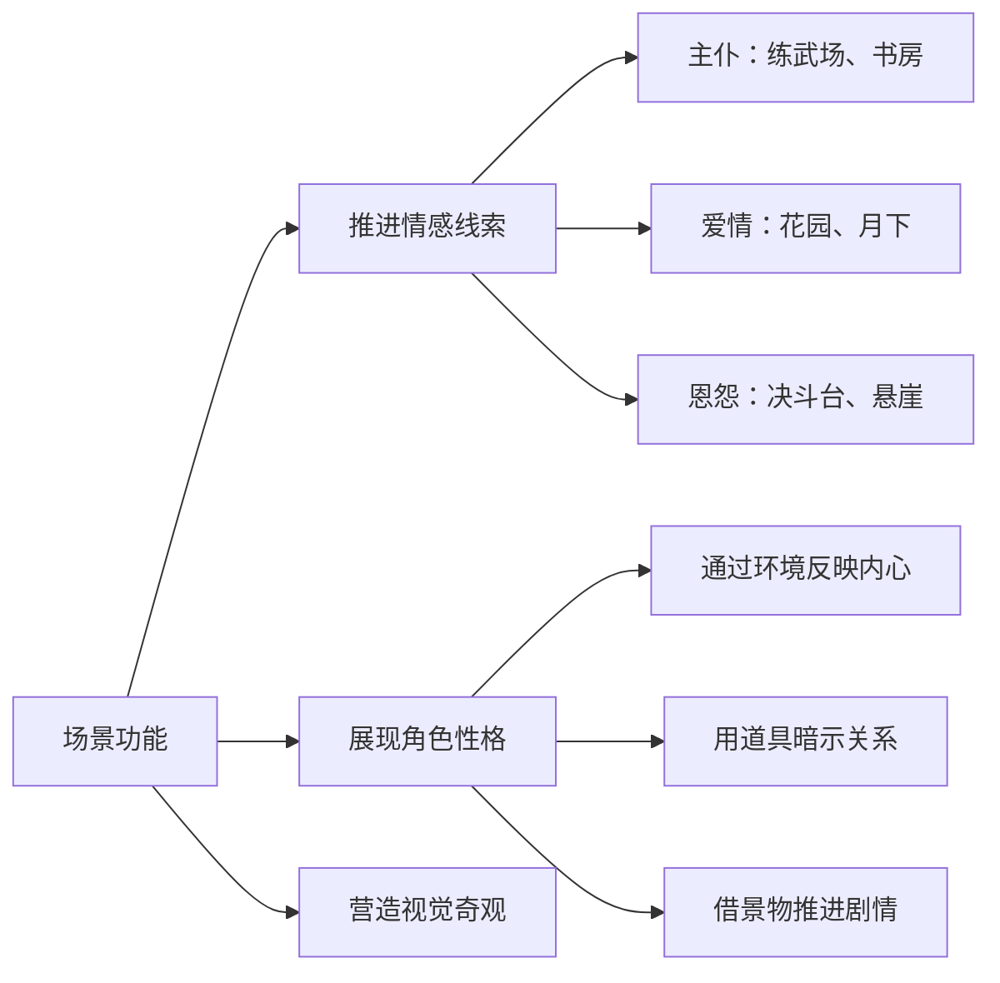
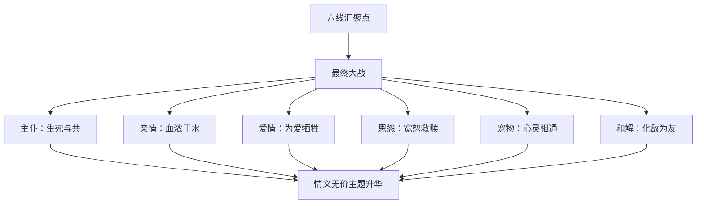

# 🎬 武侠电影六元素故事规划框架

## 📊 **故事发展流程图**



## 📋 核心元素架构设计

### 🎭 六大情感线索规划

#### 1️⃣ 主仆关系线
**设定原则**：忠诚与身份的双重考验
- **初期**：传统主仆关系，忠诚无疑
- **中期**：身份真相揭露，关系动摇
- **后期**：超越血缘的兄弟情深
- **核心冲突**：血统 vs 情义，传统 vs 真心

#### 2️⃣ 亲情纽带线
**设定原则**：血缘与养育的情感博弈
- **血缘亲情**：生父母的寻找与认知
- **养育亲情**：养父母的恩情与愧疚
- **兄弟亲情**：真假兄弟的身份转换
- **核心冲突**：生养之恩的道德选择

#### 3️⃣ 爱情考验线
**设定原则**：真心与任务的痛苦抉择
- **相遇阶段**：命运安排的美好邂逅
- **深入阶段**：真情流露与身份隐瞒
- **危机阶段**：任务暴露与信任崩塌
- **升华阶段**：为爱背叛与生死相依

#### 4️⃣ 恩怨情仇线
**设定原则**：复仇与宽恕的心路历程
- **仇恨种子**：家族恩怨的历史根源
- **复仇驱动**：误解加深的报复行动
- **真相大白**：恩怨背后的隐秘真相
- **情仇了结**：宽恕与救赎的最终选择

#### 5️⃣ 人兽情深线
**设定原则**：灵性伙伴的成长陪伴
- **初遇结缘**：救助与被救的命运纽带
- **相伴成长**：共同历险的深厚友谊
- **生死考验**：关键时刻的舍身相救
- **心灵相通**：超越种族的精神契合

#### 6️⃣ 和解升华线
**设定原则**：从对立到理解的情感转化
- **误解对立**：各方立场的根本冲突
- **真相揭示**：隐藏秘密的逐步曝光
- **理解包容**：换位思考的情感共鸣
- **携手共进**：化敌为友的最终和解

## 🎭 **角色弧光设计**

### 👤 **主角成长轨迹**



### 🎯 **配角弧光规划**

- **阿福**：忠仆→真相震撼→选择情义→兄弟情深
- **柳如烟**：任务执行→真情流露→背叛组织→生死相依
- **慕容寒**：复仇驱动→真相大白→内心挣扎→最终和解
- **雪狐**：神秘灵兽→身份揭示→情义相助→精神升华

## 🔥 **冲突层级分析**

### 📊 **四层冲突结构**

```mermaid
pyramid
    title 冲突层级金字塔
    
    "价值冲突" : 传统忠义 vs 现代情感
    "环境冲突" : 江湖险恶 vs 个人理想
    "人际冲突" : 各方立场 vs 利益纠葛
    "内在冲突" : 身份认知 vs 道德选择
```

**冲突详解**：
- **内在冲突**：嚣的身份认知危机，阿福的忠诚与血缘矛盾
- **人际冲突**：主仆关系变化，爱情信任危机，家族恩怨对立
- **环境冲突**：江湖追杀压力，朝廷势力介入，血月宝典争夺
- **价值冲突**：传统等级观念与真情实意，复仇正义与宽恕大爱

## 🌟 六线交织发展策略

### 📈 三幕式情感递进

**第一幕：建立与铺垫**
- 主仆：展现传统忠诚关系
- 亲情：暗示身世疑云
- 爱情：浪漫相遇与初恋
- 恩怨：仇敌登场与对立
- 宠物：奇遇结缘与陪伴
- 和解：埋下误解种子

**第二幕：冲突与考验**
- 主仆：身份真相的冲击
- 亲情：血缘与养育的撕扯
- 爱情：任务与真心的矛盾
- 恩怨：复仇行动的升级
- 宠物：生死考验的忠诚
- 和解：对立加深的危机

**第三幕：升华与圆满**
- 主仆：超越血统的兄弟情
- 亲情：包容理解的家族和谐
- 爱情：为爱牺牲的真情告白
- 恩怨：宽恕救赎的心灵净化
- 宠物：心灵相通的永恒陪伴
- 和解：化敌为友的大团圆

### 🔄 情感线索互动机制

**相互促进**：
- 主仆情深推动亲情认知
- 爱情考验加深恩怨理解
- 宠物忠诚启发人际和解

**相互制约**：
- 恩怨冲突考验主仆关系
- 身份真相冲击爱情信任
- 亲情纠葛影响和解进程

**共同升华**：
- 六线最终汇聚于"情义无价"主题
- 所有关系都指向"真心相待"核心
- 实现从个人恩怨到大爱无疆的境界提升

## 🎯 故事主题统一

**核心价值观**：情义胜过血统，真心超越利益
**情感内核**：在复杂的人际关系中寻找真正的情感归属
**精神升华**：从小我的恩怨情仇到大我的包容和解

## 🎬 **实用执行指南**

### 🎨 **场景设计原则**



### 💬 **对白创作要点**

- **武侠特色用词**：江湖、侠义、恩怨、情仇
- **情感层次递进**：从表面客套到内心真话
- **身份暗示技巧**：通过称谓变化体现关系发展
- **冲突激化手法**：用对比强烈的价值观碰撞

### ⏰ **节奏控制方法**

**时间分配建议**：
- **第一幕（30分钟）**：六线建立，各占5分钟
- **第二幕（60分钟）**：冲突交织，重点线索各占15分钟
- **第三幕（30分钟）**：升华圆满，六线合一

**交织节奏**：
- **并行推进**：同时展现多条线索发展
- **交替聚焦**：重点突出当前主要矛盾
- **高潮汇聚**：六线在climax处形成合力

### 🌟 **高潮设计策略**



## ✅ **创作检查清单**

### 📋 **六线完成度评估**

**主仆关系线**：
- [ ] 传统忠诚关系建立
- [ ] 身份真相冲击展现
- [ ] 超越血统的情义选择
- [ ] 兄弟情深的最终升华

**亲情纽带线**：
- [ ] 血缘与养育的双重设定
- [ ] 身世真相的逐步揭露
- [ ] 道德选择的痛苦挣扎
- [ ] 包容理解的家族和谐

**爱情考验线**：
- [ ] 浪漫邂逅的美好开始
- [ ] 身份隐瞒的甜蜜危机
- [ ] 任务暴露的信任崩塌
- [ ] 为爱背叛的生死相依

**恩怨情仇线**：
- [ ] 家族恩怨的历史根源
- [ ] 复仇行动的逐步升级
- [ ] 真相大白的情感转折
- [ ] 宽恕救赎的精神升华

**人兽情深线**：
- [ ] 奇遇结缘的命运安排
- [ ] 共同成长的深厚友谊
- [ ] 生死考验的忠诚展现
- [ ] 心灵相通的精神契合

**和解升华线**：
- [ ] 各方对立的根本冲突
- [ ] 误解加深的危机升级
- [ ] 真相揭示的理解契机
- [ ] 化敌为友的最终和解

### ⚠️ **常见问题及解决方案**

**问题1：六线发展不平衡**
- **解决**：制定详细的时间分配表，确保每条线索都有充分展现

**问题2：角色动机不够清晰**
- **解决**：为每个角色设计明确的目标和障碍，动机要符合人物性格

**问题3：冲突解决过于突兀**
- **解决**：设置充分的铺垫和过渡，让角色转变有合理的心理过程

**问题4：主题表达过于直白**
- **解决**：通过行动和细节暗示主题，避免说教式的台词表达

### 🎯 **经典参考案例**

**主仆情深**：《射雕英雄传》郭靖与哲别
**身世之谜**：《天龙八部》萧峰身世
**爱情考验**：《神雕侠侣》杨过小龙女
**恩怨化解**：《笑傲江湖》令狐冲与岳不群
**人兽情深**：《神雕侠侣》杨过与神雕
**江湖和解**：《倚天屠龙记》六大派围攻光明顶后的化解

---

*创建时间：2024年*
*项目：武侠电影《江影》*
*用途：故事架构规划与情感线索设计*
*版本：v2.0 - 女娲专业指导升级版*
