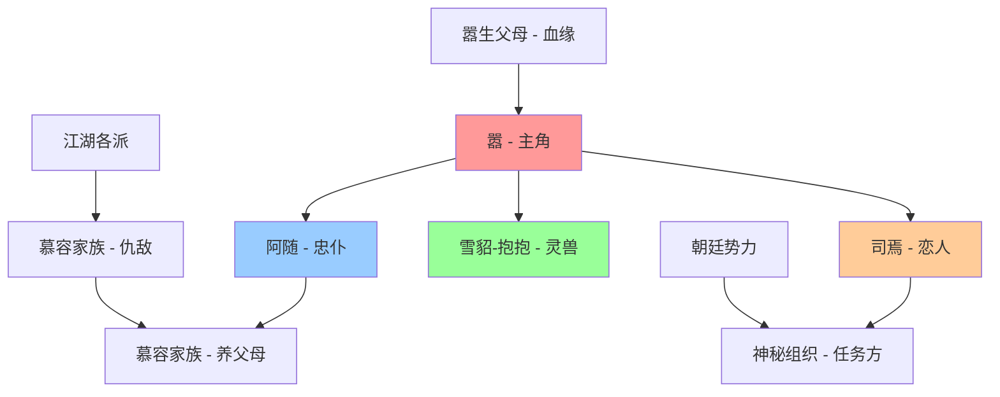

# 🏗️ 《江影》小说技术架构设计

## 📋 架构设计概述

**设计者**：首席架构师（Luban）  
**设计时间**：2025年1月  
**项目类型**：武侠小说技术架构  
**基础框架**：武侠电影六元素故事规划框架  

## 🎯 核心架构原则

### 1. 六线交织原则
- **平衡发展**：六条情感线索均衡推进，避免单线突出
- **互动促进**：线索间相互影响，形成有机整体
- **层次递进**：从建立→冲突→升华的三幕式发展
- **主题统一**：所有线索最终汇聚于"情义无价"核心主题

### 2. 章节结构原则
- **模块化设计**：每章独立完整，同时服务整体架构
- **节奏控制**：张弛有度，高潮与缓冲交替出现
- **视角切换**：多角度叙述，丰富故事层次
- **悬念设置**：每章结尾留有悬念，推动阅读欲望

## 📚 章节架构设计

### 🌟 前传设定（背景故事）

**第0章：血夜逃亡**（7年前）
- **事件**：家族仇杀，父母护子逃亡，嚣堕落悬崖
- **意义**：奠定仇恨基调，解释主角身世

**第0.5章：山崖奇遇**（7年前）
- **事件**：7岁嚣遇雪貂-抱抱，山崖秘境生存7年
- **武学启蒙**：雪貂传授"兽性武学"基础
- **性格塑造**：野性与纯真并存的独特性格

### 🎭 三幕式结构规划

```
第一幕：重逢与觉醒（第1-8章）
├── 第1章：山林重逢（阿随找到13岁嚣）
├── 第2章：身世回忆（回忆7年前血夜）
├── 第3章：下山入世（野性嚣回归文明）
├── 第4章：江湖初现（遇到司焉）
├── 第5章：武功显露（兽性武学震惊江湖）
├── 第6章：仇家现身（慕容家族发现嚣）
├── 第7章：盟友聚集（四人组团队形成）
└── 第8章：暗流涌动（多方势力介入）

第二幕：冲突与成长（第9-20章）
├── 第9章：身份震撼（嚣真实身世更复杂）
├── 第10章：血缘真相（与慕容家族血缘关系）
├── 第11章：爱情考验（司焉神秘组织身份）
├── 第12章：复仇升级（武林大会公开对决）
├── 第13章：生死考验（雪貂-抱抱为救嚣受伤）
├── 第14章：对立加深（各方矛盾激化）
├── 第15章：真相大白（7年前血夜完整真相）
├── 第16章：痛苦抉择（复仇还是宽恕）
├── 第17章：背叛与忠诚（司焉背叛组织，阿随超越血统）
├── 第18章：绝境求生（昔日敌人联手对抗邪恶）
├── 第19章：最终对决（真正幕后黑手现身）
└── 第20章：黎明前夜（胜利代价，成长完成）

第三幕：升华与圆满（第21-28章）
├── 第21章：兄弟情深（嚣与阿随成为真兄弟）
├── 第22章：家族和谐（与慕容家族和解）
├── 第23章：生死相依（嚣与司焉生死之恋）
├── 第24章：宽恕救赎（以德报怨最高境界）
├── 第25章：心灵相通（与雪貂-抱抱精神融合）
├── 第26章：化敌为友（所有敌对关系化解）
├── 第27章：大战终章（对抗威胁武林的终极邪恶）
└── 第28章：江影传说（从复仇者到守护者）
```

### 📊 章节功能分配表

| 章节 | 主要功能 | 重点线索 | 次要线索 | 节奏类型 |
|------|----------|----------|----------|----------|
| 0-0.5| 前传背景 | 身世设定 | 武学启蒙 | 悲壮奠基 |
| 1-2  | 重逢回忆 | 主仆线   | 身世揭露 | 缓慢建立 |
| 3-4  | 入世邂逅 | 爱情线   | 文明冲突 | 温馨浪漫 |
| 5-6  | 武功仇敌 | 恩怨线   | 兽性武学 | 紧张悬疑 |
| 7-8  | 团队势力 | 六线交织 | 江湖纷争 | 节奏加快 |
| 9-12 | 身世血缘 | 亲情+恩怨| 武林大会 | 激烈冲突 |
| 13-16| 生死真相 | 人兽+和解| 道德选择 | 紧张刺激 |
| 17-20| 背叛联手 | 忠诚+正义| 终极对决 | 情感深沉 |
| 21-24| 情义升华 | 四线圆满 | 宽恕救赎 | 温暖感动 |
| 25-28| 传说诞生 | 六线合一 | 侠者精神 | 壮阔圆满 |

## 🎭 六线交织技术方案

### 🔄 交织模式设计

#### 1. 并行推进模式
- **适用章节**：第1-8章（建立期）
- **技术要点**：每章重点展现1-2条线索，其他线索作为背景
- **交织方法**：通过场景切换和角色互动自然融合

#### 2. 冲突交织模式
- **适用章节**：第9-20章（冲突期）
- **技术要点**：线索间相互影响，形成连锁反应
- **交织方法**：一条线索的发展直接影响其他线索走向

#### 3. 合一升华模式
- **适用章节**：第21-28章（升华期）
- **技术要点**：六线汇聚，共同指向主题升华
- **交织方法**：所有线索在高潮处形成合力，实现主题统一

### 📈 线索发展时间轴

```mermaid
gantt
    title 六线发展时间轴
    dateFormat X
    axisFormat %s
    
    section 主仆关系线
    传统忠诚     :1, 8
    身份冲击     :9, 16
    情义选择     :17, 24
    兄弟情深     :25, 28
    
    section 亲情纽带线
    身世疑云     :5, 10
    血缘撕扯     :11, 18
    道德选择     :19, 22
    家族和谐     :23, 28
    
    section 爱情考验线
    浪漫邂逅     :4, 8
    甜蜜危机     :9, 14
    信任崩塌     :15, 20
    生死相依     :21, 28
    
    section 恩怨情仇线
    仇敌登场     :6, 10
    复仇升级     :11, 18
    真相大白     :19, 22
    宽恕救赎     :23, 28
    
    section 人兽情深线
    奇遇结缘     :3, 8
    共同成长     :9, 16
    生死考验     :17, 22
    心灵相通     :23, 28
    
    section 和解升华线
    误解埋下     :7, 12
    对立加深     :13, 20
    理解契机     :21, 24
    化敌为友     :25, 28
```



## 👥 角色关系图谱

### 🎯 核心角色架构



### 🔗 关系发展轨迹

#### 主仆关系：嚣 ↔ 阿随
- **前传期**：7年前主仆分离，阿随开始7年寻找
- **第1-8章**：山林重逢，重建信任，野性嚣的适应
- **第9-16章**：身份真相冲击，血统vs情义的考验
- **第17-24章**：超越血统选择，情义为重
- **第25-28章**：真正的兄弟情深，主仆升华

#### 爱情关系：嚣 ↔ 司焉
- **第4-8章**：下山后浪漫邂逅，少年情窦初开
- **第9-14章**：深入交往，真情与任务的矛盾
- **第15-20章**：组织身份暴露，爱情vs任务的选择
- **第21-28章**：为爱背叛组织，生死相依的真爱

#### 人兽关系：嚣 ↔ 雪貂-抱抱
- **前传期**：7岁山崖奇遇，7年朝夕相处，武学启蒙
- **第1-8章**：下山后的适应，雪貂的保护与陪伴
- **第9-16章**：江湖历险，人兽默契的深化
- **第17-22章**：生死考验，雪貂为救嚣受伤
- **第23-28章**：心灵相通，人与自然的完美融合

## ⚙️ 技术实现规范

### 📝 写作技术标准

#### 1. 视角切换规范
- **主视角**：嚣的第三人称限知视角（70%）
- **辅助视角**：阿随、司焉视角（20%）
- **全知视角**：关键转折和高潮场面（10%）

#### 2. 时间线管理
- **线性叙述**：主要采用顺序叙述
- **插叙技巧**：用于揭示身世和历史恩怨
- **倒叙手法**：关键真相揭露时使用
- **时间跨度**：整体故事约1年时间

#### 3. 场景转换技术
- **自然过渡**：通过角色行动和对话自然切换
- **悬念连接**：前一场景结尾的悬念在下一场景解答
- **情绪承接**：保持情感基调的连贯性
- **节奏控制**：动静结合，张弛有度

### 🎨 文学技法应用

#### 1. 悬念设置技巧
- **身世悬念**：嚣的真实身份逐步揭露
- **关系悬念**：各角色间的真实关系
- **动机悬念**：角色行为背后的真实动机
- **结局悬念**：六线最终如何收束

#### 2. 冲突升级策略
- **个人冲突**：内心挣扎和道德选择
- **人际冲突**：角色间的立场对立
- **环境冲突**：江湖险恶和外部压力
- **价值冲突**：传统观念与现代情感

#### 3. 情感渲染手法
- **细节描写**：通过细微动作表现内心
- **环境烘托**：用景物描写烘托情感
- **对比手法**：通过对比强化情感冲击
- **象征手法**：用象征物件承载情感内涵

## 📊 质量控制体系

### ✅ 架构完整性检查

#### 六线发展完整性
- [ ] 每条线索都有完整的起承转合
- [ ] 线索间的交织自然合理
- [ ] 所有线索最终指向统一主题
- [ ] 没有悬而未决的重要情节

#### 角色弧光完整性
- [ ] 主角有清晰的成长轨迹
- [ ] 配角都有独立的发展弧光
- [ ] 角色动机和行为逻辑一致
- [ ] 角色关系发展合理可信

#### 结构平衡性
- [ ] 三幕式结构比例合理
- [ ] 章节长度和节奏适当
- [ ] 高潮和缓冲交替出现
- [ ] 整体节奏张弛有度

### 📈 质量评估标准

| 评估维度 | 权重 | 评分标准 | 目标分数 |
|----------|------|----------|----------|
| 故事完整性 | 25% | 情节完整，逻辑清晰 | ≥95分 |
| 角色塑造度 | 20% | 人物鲜明，发展合理 | ≥90分 |
| 情感线索平衡 | 20% | 六线均衡，交织自然 | ≥88分 |
| 武侠风格一致性 | 15% | 风格统一，特色鲜明 | ≥92分 |
| 文学技法运用 | 10% | 技法娴熟，效果显著 | ≥85分 |
| 主题表达深度 | 10% | 主题深刻，升华有力 | ≥90分 |

## 🥋 武功体系架构

### 三层武学境界设计

#### 1. **兽性武学**（第一层境界）
- **来源**：7岁时从雪貂-抱抱学来的独特武功
- **特点**：野性、灵动、不拘一格，模仿动物的攻击方式
- **代表招式**：雪貂爪法、灵猫身法、野兽直觉
- **适用场景**：生死搏斗、突围逃脱、出其不意

#### 2. **情义武学**（第二层境界）
- **来源**：在人际关系中领悟的高深武学
- **特点**：以情驭气，以义化劲，武功与情感融合
- **代表招式**：主仆同心掌、兄弟连环剑、生死相依功
- **适用场景**：保护他人、团队作战、情感升华时刻

#### 3. **天人合一**（最高境界）
- **来源**：最终达到的武学至境
- **特点**：人兽合一，情理并重，超越技巧的精神境界
- **代表招式**：六线归一功、情义无价掌、江影传说剑
- **适用场景**：终极对决、精神升华、传说诞生

## 🚀 实施计划

### 📅 架构实施时间表

**第1天：架构设计完成**
- [x] 完成技术架构设计文档
- [ ] 提交给故事架构师审核
- [ ] 根据反馈进行调整优化

**第2天：详细规划**
- [ ] 制定详细的章节大纲
- [ ] 完善角色关系图谱
- [ ] 确定关键场景设置

**第3-7天：专业创作阶段**
- [ ] 故事架构师基于技术架构设计完整大纲
- [ ] 人物设计师深化角色设定
- [ ] 场景构建师构建具体场景
- [ ] 对话编剧设计精彩对白

### 🎯 后续协作接口

#### 角色弧光发展轨迹
- **阿随**：忠仆→真相震撼→选择情义→兄弟情深
- **司焉**：任务执行→真情流露→背叛组织→生死相依
- **慕容家族**：复仇驱动→真相大白→内心挣扎→最终和解
- **雪貂-抱抱**：神秘灵兽→身份揭示→情义相助→精神升华

#### 与故事架构师协作
- **输入**：技术架构设计方案
- **输出**：详细故事大纲
- **协作要点**：确保大纲符合六线交织技术要求

#### 与人物设计师协作
- **输入**：角色关系图谱
- **输出**：详细角色档案
- **协作要点**：角色设定要支撑六线发展需求

#### 与场景构建师协作
- **输入**：章节结构和场景需求
- **输出**：具体场景描述
- **协作要点**：场景设计要服务情感线索推进

#### 与对话编剧协作
- **输入**：角色关系和情感发展
- **输出**：精彩对话脚本
- **协作要点**：对话要体现角色性格和关系变化

---

**架构设计完成**  
**下一步**：提交故事架构师进行详细大纲设计  
**预期成果**：基于此技术架构的完整武侠小说《江影》  
**质量目标**：整体质量评分≥85分，各项指标达到预设标准