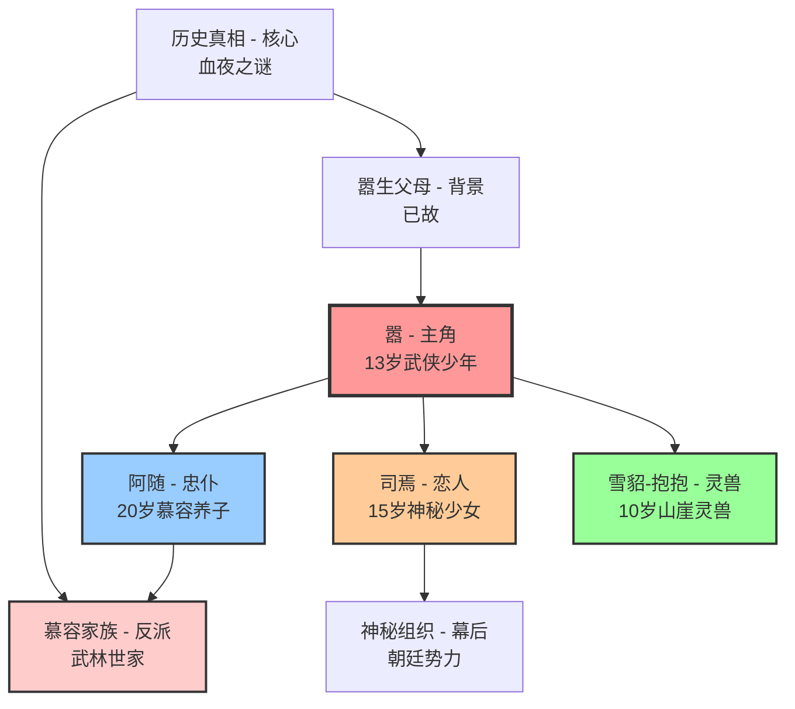

# 🌐 《江影》角色关系总览

## 📋 角色设定完成状态

**设计完成时间**：2025年1月  
**设计者**：人物设计师  
**设计状态**：✅ 已完成  
**下一步**：配合故事架构师进行章节内容创作  

## 👥 核心角色架构图

## 🎭 六线交织角色分配

### 1️⃣ 主仆关系线：嚣 ↔ 阿随
**核心冲突**：血缘 vs 情义  
**发展轨迹**：忠诚 → 冲击 → 选择 → 升华  
**关键节点**：
- 第1章：山林重逢，重建信任
- 第10章：血缘真相暴露
- 第17章：阿随选择情义
- 第21章：升华为真兄弟

### 2️⃣ 亲情纽带线：嚣 ↔ 慕容家族
**核心冲突**：仇恨 vs 血缘  
**发展轨迹**：仇敌 → 真相 → 理解 → 和解  
**关键节点**：
- 第6章：仇敌现身
- 第15章：历史真相大白
- 第22章：开始理解和解
- 第26章：完全化敌为友

### 3️⃣ 爱情考验线：嚣 ↔ 司焉
**核心冲突**：真情 vs 任务  
**发展轨迹**：邂逅 → 热恋 → 背叛 → 相依  
**关键节点**：
- 第4章：浪漫邂逅
- 第11章：深入交往
- 第18章：背叛组织
- 第23章：生死相依

### 4️⃣ 恩怨情仇线：嚣 ↔ 历史真相
**核心冲突**：复仇 vs 宽恕  
**发展轨迹**：仇恨 → 真相 → 选择 → 救赎  
**关键节点**：
- 第2章：血夜回忆
- 第15章：完整真相
- 第20章：选择宽恕
- 第24章：宽恕救赎

### 5️⃣ 人兽情深线：嚣 ↔ 雪貂-抱抱
**核心冲突**：文明 vs 自然  
**发展轨迹**：师徒 → 伙伴 → 考验 → 相通  
**关键节点**：
- 第0.5章：山崖奇遇
- 第13章：生死考验
- 第25章：心灵相通
- 第28章：天人合一

### 6️⃣ 和解升华线：所有角色
**核心冲突**：对立 vs 和谐  
**发展轨迹**：误解 → 对立 → 契机 → 和解  
**关键节点**：
- 第7章：多方势力对立
- 第19章：理解契机出现
- 第25章：全面和解
- 第28章：完美升华

## 📊 角色发展时间轴

| 时期 | 嚣 | 阿随 | 司焉 | 抱抱 | 慕容家族 |
|------|----|----|----|----|----------|
| **前传期** | 7岁血夜逃亡 山崖奇遇 | 开始7年寻找 | 组织训练 | 救下嚣 武学启蒙 | 仇恨种子 |
| **第1-8章** | 野性少年 适应社会 | 重逢喜悦 小心照顾 | 任务执行 情感觉醒 | 忠实伙伴 保护嚣 | 复仇行动 追杀嚣 |
| **第9-16章** | 身世震撼 价值冲击 | 身份冲击 内心挣扎 | 真情流露 任务冲突 | 智慧导师 默契提升 | 真相震撼 开始反思 |
| **第17-24章** | 道德选择 选择宽恕 | 情义选择 背叛血缘 | 痛苦选择 背叛组织 | 生死与共 牺牲精神 | 内心挣扎 逐渐理解 |
| **第25-28章** | 侠者风范 传说诞生 | 兄弟升华 平等伙伴 | 生死相依 完美爱情 | 心灵相通 天人合一 | 和解升华 化敌为友 |

## 🎯 角色功能分析

### 🌟 主角：嚣
**故事功能**：
- 六线交织的核心连接点
- 价值观转变的载体
- 主题升华的实现者

**性格特色**：
- 野性与纯真并存
- 从复仇者到守护者
- 情义超越血仇

### 🛡️ 忠仆：阿随
**故事功能**：
- 血缘与情义冲突的体现者
- 嚣与人类社会的桥梁
- "情义无价"主题的践行者

**性格特色**：
- 忠诚不渝的品格
- 痛苦的道德选择
- 超越血缘的情义

### 💕 恋人：司焉
**故事功能**：
- 爱情线索的推动者
- 任务与真情的冲突载体
- 背叛与忠诚的选择者

**性格特色**：
- 聪明机智的双重身份
- 从虚假到真实的转变
- 为爱牺牲的勇气

### 🐾 灵兽：雪貂-抱抱
**故事功能**：
- 人兽情深线的核心
- 武学传承的载体
- 自然与文明和谐的象征

**性格特色**：
- 超越物种的智慧
- 无私奉献的精神
- 心灵相通的境界

### ⚔️ 反派：慕容家族
**故事功能**：
- 主要冲突的制造者
- 仇恨与宽恕的对比
- 和解升华的实现者

**性格特色**：
- 复杂的仇恨动机
- 痛苦的心态转变
- 最终的精神觉悟

## 🔗 关键关系动态

### 💫 核心三角关系
**嚣-阿随-司焉**：
- 主仆情深 + 纯真爱情
- 三人在关键时刻相互支撑
- 共同面对外部威胁
- 最终形成完美的"铁三角"

### 🌟 特殊四角关系
**嚣-阿随-司焉-抱抱**：
- 人类与灵兽的和谐共处
- 四个"家人"的温馨互动
- 在战斗中的完美配合
- 代表理想的"家庭"模式

### ⚖️ 对立转化关系
**嚣方 vs 慕容家族**：
- 从世仇到血亲的转变
- 仇恨与宽恕的较量
- 传统与现代的碰撞
- 最终的和解与升华

## 📈 角色成长弧线

### 🎭 共同成长主题
1. **从仇恨到宽恕**：所有角色都经历了这个转变
2. **从个人到集体**：学会为他人着想
3. **从传统到创新**：突破传统观念的束缚
4. **从对立到和谐**：实现内心与外在的和谐

### 🌟 个性化成长
- **嚣**：野性少年 → 成熟侠客 → 传说英雄
- **阿随**：忠诚仆人 → 痛苦选择者 → 义气兄弟
- **司焉**：任务工具 → 真情少女 → 生死伴侣
- **抱抱**：山崖灵兽 → 忠实伙伴 → 心灵相通
- **慕容家族**：复仇者 → 反思者 → 和解者

## 🎨 创作指导原则

### ✍️ 角色塑造要点
1. **避免脸谱化**：每个角色都要有复杂的内心世界
2. **突出成长性**：展现角色的变化和成长
3. **保持一致性**：角色行为要符合其性格设定
4. **体现主题性**：通过角色体现"情义无价"主题

### 🎭 关系处理技巧
1. **层次分明**：不同关系有不同的重要程度
2. **动态发展**：关系要随剧情发展而变化
3. **冲突合理**：冲突要有充分的动机和逻辑
4. **和解自然**：和解过程要真实可信

### 💡 写作建议
1. **多角度叙述**：适当切换视角丰富故事层次
2. **情感真实**：让读者能够感同身受
3. **节奏控制**：在不同章节突出不同关系
4. **主题升华**：最终所有关系都指向主题升华

## 📋 后续创作接口

### 🎬 与故事架构师协作
**输入内容**：完整的角色档案和关系网络  
**协作重点**：
- 确保每章都有明确的角色发展重点
- 平衡六线交织中的角色戏份
- 设计关键的角色互动场景
- 安排角色成长的关键节点

### 🏞️ 与场景构建师协作
**输入内容**：角色关系和情感需求  
**协作重点**：
- 为不同关系设计合适的场景
- 营造有利于角色发展的环境
- 创造促进关系转变的特殊场景
- 设计体现角色特色的标志性场所

### 💬 与对话编剧协作
**输入内容**：角色性格和语言特色  
**协作重点**：
- 为每个角色设计独特的对话风格
- 创作推进关系发展的关键对话
- 设计体现角色成长的经典台词
- 编写促进和解的重要对白

### 📊 与质量评估协作
**输入内容**：角色设定的完整性和合理性  
**评估重点**：
- 角色性格的一致性和发展性
- 角色关系的逻辑性和真实性
- 角色功能的完整性和有效性
- 主题体现的深度和感染力

---

**角色设定阶段完成** ✅  
**当前状态**：等待故事架构师接手章节内容创作  
**下一阶段**：基于角色档案进行详细的章节内容设计  
**最终目标**：创作出人物鲜明、关系丰富的高质量武侠小说