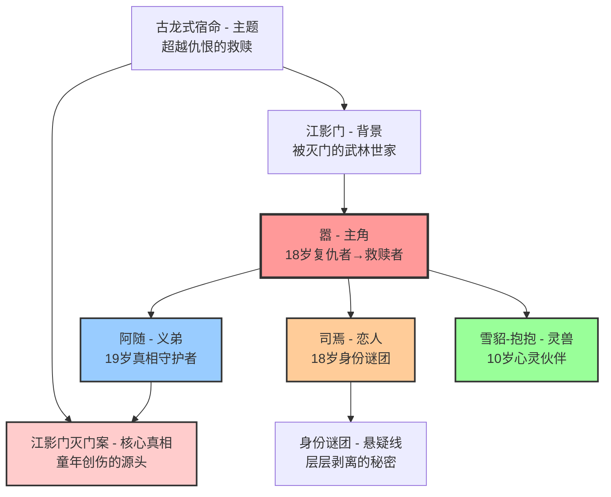

# 🌐 《江影》角色关系总览

## 📋 角色设定完成状态

**设计完成时间**：2025年1月  
**设计者**：人物设计师  
**设计状态**：✅ 已完成  
**下一步**：配合故事架构师进行章节内容创作  

## 👥 核心角色架构图（古龙式优化版）

## 🎭 古龙式四阶段虐恋与角色关系

### 🌸 第一阶段：甜蜜的欺骗（1-6章）
**核心关系**：嚣 ↔ 司焉 ↔ 阿随  
**情感特色**：纯真甜蜜，暗藏危机  
**关键节点**：
- 第1章：温柔照料，建立信任
- 第3章：月下练剑，情愫初生
- 第4章：星空许愿，初吻定情
- 第5章：身份疑云，暗流涌动
- 第6章：月下练剑，感情升温

### 💔 第二阶段：真相的撕裂（7-14章）
**核心关系**：嚣 ↔ 江影门真相 ↔ 阿随记忆  
**情感特色**：痛苦撕裂，信任崩塌  
**关键节点**：
- 第7章：宿命的十字路口，司焉"背叛"
- 第10章：身份揭露，世界崩塌
- 第12章：童年回忆，真相浮现
- 第14章：绝境告白，情深不悔

### ⚔️ 第三阶段：痛苦的救赎（15-18章）
**核心关系**：嚣 ↔ 复仇选择 ↔ 阿随牺牲  
**情感特色**：生死考验，灵魂救赎  
**关键节点**：
- 第15章：雨夜决斗，生死相搏
- 第16章：抱抱背叛，信任再碎
- 第17章：残酷觉醒，面对现实
- 第18章：阿随牺牲，兄弟诀别

### 🌟 第四阶段：超越的升华（19-20章）
**核心关系**：嚣 ↔ 宽恕选择 ↔ 爱的传承  
**情感特色**：超越仇恨，悲壮圆满  
**关键节点**：
- 第19章：血泪忏悔，内心觉醒
- 第20章：爱的传承，悲壮圆满

### 🔗 贯穿始终的核心关系

#### 💫 兄弟情深线：嚣 ↔ 阿随
**核心冲突**：友情 vs 真相的重负  
**古龙特色**：小人物承载大秘密的悲壮

#### 🌊 身份谜团线：嚣 ↔ 司焉
**核心冲突**：爱情 vs 身份的束缚  
**古龙特色**：层层剥离的身份悬疑

#### 🐾 心灵相通线：嚣 ↔ 抱抱
**核心冲突**：人性 vs 兽性的融合  
**古龙特色**：超越物种的精神境界

## 📊 古龙式角色发展时间轴（20章结构）

| 阶段 | 嚣 | 阿随 | 司焉 | 抱抱 | 核心冲突 |
|------|----|----|----|----|----------|
| **前传期** | 13岁江影门灭门 山崖奇遇抱抱 | 灭门案幸存者 记忆被封印 | 身份谜团的起源 命运的安排 | 救下嚣 成为心灵伙伴 | 悲剧的种子 |
| **第1-6章 甜蜜欺骗** | 重回人间 纯真恋爱 | 忠义兄弟 暗藏痛苦 | 温柔恋人 身份疑云 | 忠实伙伴 默默守护 | 表面和谐 暗流涌动 |
| **第7-14章 真相撕裂** | 身份震撼 信任崩塌 | 记忆苏醒 真相重负 | 身份揭露 爱恨交织 | 困惑不解 忠诚考验 | 所有谎言 被戳破 |
| **第15-18章 痛苦救赎** | 复仇冲动 道德选择 | 牺牲准备 守护真相 | 生死相依 共同面对 | 背叛考验 最终回归 | 生死考验 灵魂救赎 |
| **第19-20章 超越升华** | 宽恕选择 精神觉醒 | 悲壮牺牲 兄弟永恒 | 爱的坚守 身份超越 | 心灵相通 天人合一 | 超越仇恨 悲壮圆满 |

## 🎯 古龙式角色功能分析

### 🌟 主角：嚣（从复仇者到自我救赎者）
**古龙式定位**：
- 四阶段虐恋的核心承受者
- 从仇恨到宽恕的精神历程载体
- 古龙式"超越宿命"主题的实现者

**性格特色**：
- 野性与纯真的矛盾统一
- 复仇冲动与善良本性的斗争
- 最终选择宽恕的精神觉醒

### 🛡️ 义弟：阿随（忠义与真相的守护者）
**古龙式定位**：
- 小人物承载大秘密的悲剧典型
- 友情与真相冲突的痛苦承担者
- 用牺牲诠释忠义的古龙式英雄

**性格特色**：
- 承载真相的沉重负担
- 对友情的绝对忠诚
- 悲壮牺牲的英雄气概

### 💕 恋人：司焉（命运的棋子与反抗者）
**古龙式定位**：
- 身份谜团的层层剥离载体
- 爱情与宿命冲突的体现者
- 用真情战胜身份束缚的觉醒者

**性格特色**：
- 复杂身份背后的真实情感
- 在爱情中的觉醒与成长
- 超越身份选择真我的勇气

### 🐾 灵兽：雪貂-抱抱（心灵相通的精神伙伴）
**古龙式定位**：
- 人兽合一境界的象征
- 嚣内心世界的外化体现
- 超越物种的精神境界载体

**性格特色**：
- 超越语言的心灵感应
- 对嚣的无条件忠诚与理解
- 在关键时刻的智慧指引

### ⚔️ 真相核心：江影门灭门案
**古龙式定位**：
- 所有痛苦和冲突的根源
- 推动剧情发展的核心动力
- 考验所有角色的试金石

**功能特色**：
- 层层剥离的悬疑真相
- 考验人性的道德选择
- 最终救赎的精神洗礼

## 🔗 关键关系动态

### 💫 核心三角关系
**嚣-阿随-司焉**：
- 主仆情深 + 纯真爱情
- 三人在关键时刻相互支撑
- 共同面对外部威胁
- 最终形成完美的"铁三角"

### 🌟 特殊四角关系
**嚣-阿随-司焉-抱抱**：
- 人类与灵兽的和谐共处
- 四个"家人"的温馨互动
- 在战斗中的完美配合
- 代表理想的"家庭"模式

### ⚖️ 对立转化关系
**嚣方 vs 慕容家族**：
- 从世仇到血亲的转变
- 仇恨与宽恕的较量
- 传统与现代的碰撞
- 最终的和解与升华

## 📈 角色成长弧线

### 🎭 共同成长主题
1. **从仇恨到宽恕**：所有角色都经历了这个转变
2. **从个人到集体**：学会为他人着想
3. **从传统到创新**：突破传统观念的束缚
4. **从对立到和谐**：实现内心与外在的和谐

### 🌟 个性化成长
- **嚣**：野性少年 → 成熟侠客 → 传说英雄
- **阿随**：忠诚仆人 → 痛苦选择者 → 义气兄弟
- **司焉**：任务工具 → 真情少女 → 生死伴侣
- **抱抱**：山崖灵兽 → 忠实伙伴 → 心灵相通
- **慕容家族**：复仇者 → 反思者 → 和解者

## 🎨 创作指导原则

### ✍️ 角色塑造要点
1. **避免脸谱化**：每个角色都要有复杂的内心世界
2. **突出成长性**：展现角色的变化和成长
3. **保持一致性**：角色行为要符合其性格设定
4. **体现主题性**：通过角色体现"情义无价"主题

### 🎭 关系处理技巧
1. **层次分明**：不同关系有不同的重要程度
2. **动态发展**：关系要随剧情发展而变化
3. **冲突合理**：冲突要有充分的动机和逻辑
4. **和解自然**：和解过程要真实可信

### 💡 写作建议
1. **多角度叙述**：适当切换视角丰富故事层次
2. **情感真实**：让读者能够感同身受
3. **节奏控制**：在不同章节突出不同关系
4. **主题升华**：最终所有关系都指向主题升华

## 📋 后续创作接口

### 🎬 与故事架构师协作
**输入内容**：完整的角色档案和关系网络  
**协作重点**：
- 确保每章都有明确的角色发展重点
- 平衡六线交织中的角色戏份
- 设计关键的角色互动场景
- 安排角色成长的关键节点

### 🏞️ 与场景构建师协作
**输入内容**：角色关系和情感需求  
**协作重点**：
- 为不同关系设计合适的场景
- 营造有利于角色发展的环境
- 创造促进关系转变的特殊场景
- 设计体现角色特色的标志性场所

### 💬 与对话编剧协作
**输入内容**：角色性格和语言特色  
**协作重点**：
- 为每个角色设计独特的对话风格
- 创作推进关系发展的关键对话
- 设计体现角色成长的经典台词
- 编写促进和解的重要对白

### 📊 与质量评估协作
**输入内容**：角色设定的完整性和合理性  
**评估重点**：
- 角色性格的一致性和发展性
- 角色关系的逻辑性和真实性
- 角色功能的完整性和有效性
- 主题体现的深度和感染力

---

**角色设定阶段完成** ✅  
**当前状态**：等待故事架构师接手章节内容创作  
**下一阶段**：基于角色档案进行详细的章节内容设计  
**最终目标**：创作出人物鲜明、关系丰富的高质量武侠小说